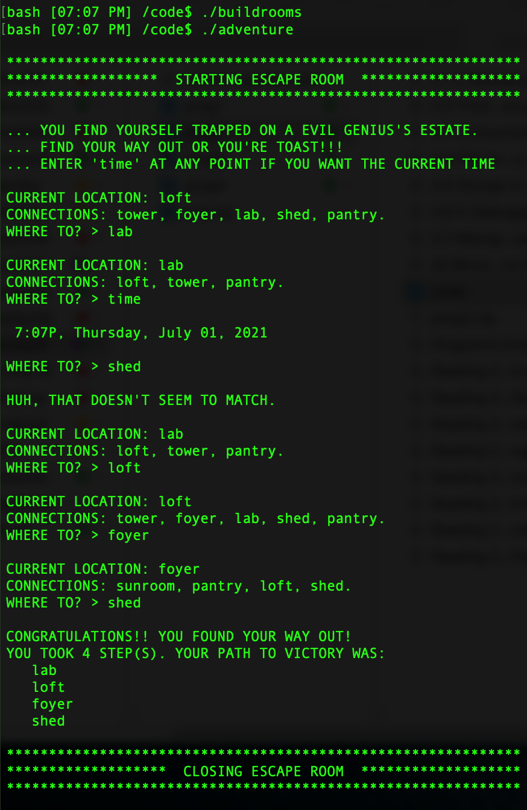

# Text Game Escape Room - threads and c strings

###### This program runs a basic adventure game on a graph of connected rooms. The user must navigate through to escape. This program demonstrates threads, mutexes, and graphs using file I/O, C string operations, and struct pointer arrays.

## Requirements
- gcc compiler

## Usage
 Compile buildrooms: `gcc -o buildrooms buildroom.c`

 Compile adventure: `gcc -o adventure adventure.c -lpthread`

 - Run `./buildrooms` to build a new directory of room files, each of which represents a node of a graph containing a name, list of connections, and room type. This directory must be present to run `/.adventure`. Run `./buildrooms` again to get a new randomized graph.

- `./adventure` runs the game and will locate the most recent directory.

  - The user enters the name of a room they are connected to or 'time' at any point in the game to get the current time.

  - The game is over when they reach the escape room. The path to victory is printed along with the number of steps it took.

  - You will be prompted again if the input does not match the room connections or you do not enter 'time'.

## Output

